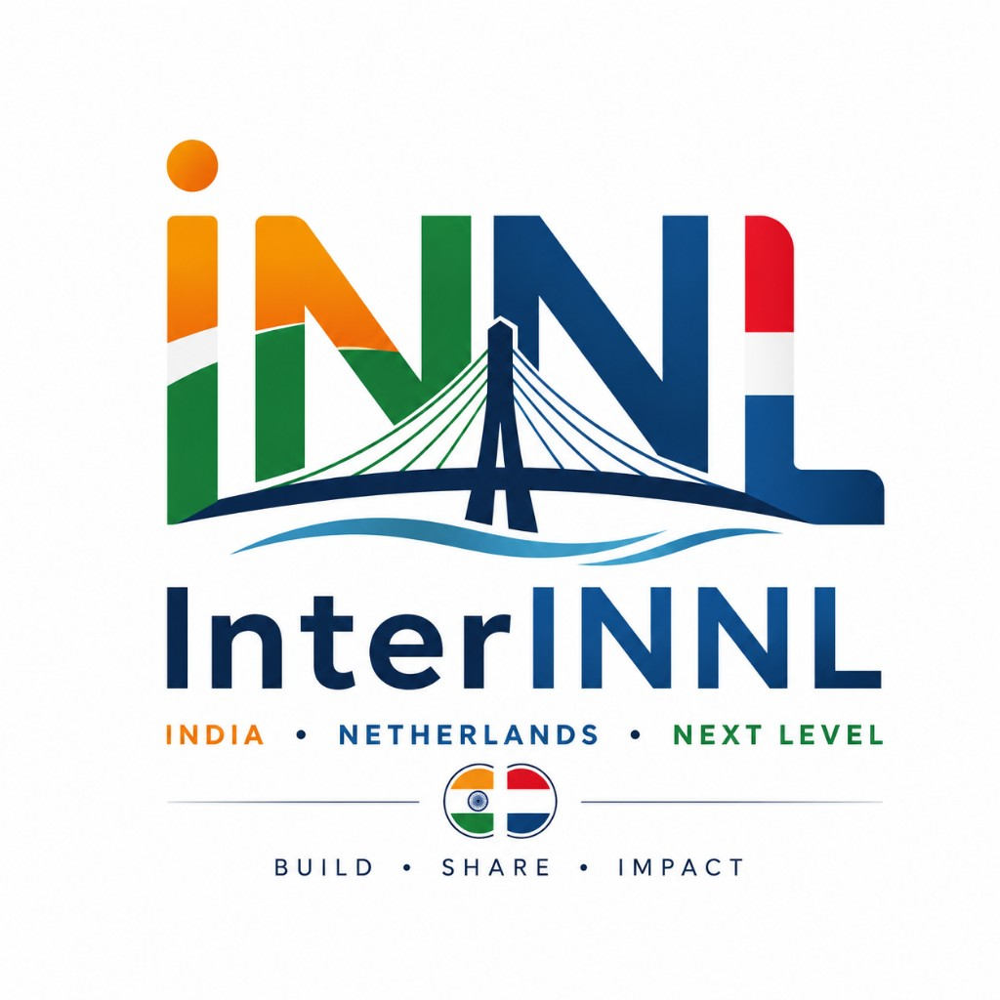
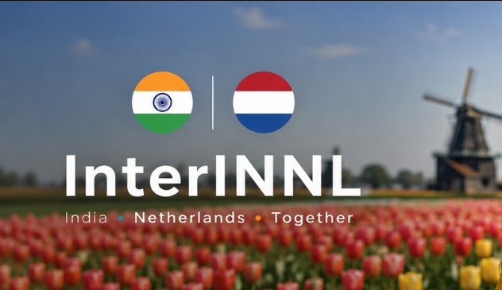

# InterINNL

**India × Netherlands × Next Level**

  

<strong>BUILD · SHARE · IMPACT</strong>

  

InterINNL is a community connecting people across **India** and the **Netherlands** around **AI**, **LLMs**, **blockchain**, Rust, technology and open source.

We bring together students, developers, engineers and families who build across borders: Indian talent, engineers already in the Netherlands, Dutch builders, and open-source projects with real-world impact.

---

## What we build around

| Focus | Why it matters here |
| --- | --- |
| **AI & LLMs** | Practical models, agents and tooling shipped by builders on both sides of the bridge |
| **Blockchain / CosmWasm** | Verifiable data and open protocols (see AquaChain) |
| **Rust** | Systems, Wasm and serious engineering craft |
| **Open source** | Public GitHub, demos, contributors, not slide decks |
| **Water & climate** | Dutch expertise × Indian scale, starting with AquaChain |

---

## The bridge

| India | ↔ | Netherlands |
| --- | --- | --- |
| Students and early-career builders | | Dutch engineering culture |
| Engineers relocating for tech careers | | Companies and open-source maintainers |
| AI / LLM / blockchain ideas at scale | | Water, climate and deep-tech craft |

**IN → NL.** The name is the mission.

---

## Where we meet

| Channel | Link |
| --- | --- |
| Community site | [interinnl.interchouette.net](https://interinnl.interchouette.net/) |
| LinkedIn group | [InterINNL on LinkedIn](https://www.linkedin.com/groups/42420002/) |
| GitHub org | [github.com/InterINNL](https://github.com/InterINNL) |

---

## Projects

### AquaChain

Open-source CosmWasm + Angular demo for smarter, more trusted water management: IoT sensors, **blockchain** verification, and room for **AI** analytics.

| | |
| --- | --- |
| Live demo | [interinnl.interchouette.net/aquachain](https://interinnl.interchouette.net/aquachain/) |
| Frontend | [Aquachain-frontend](https://github.com/InterINNL/Aquachain-frontend) |
| Contracts | [Aquachain-contracts](https://github.com/InterINNL/Aquachain-contracts) |

Modules today: **Citizen Science**, **Water Well Initiative**, **Water Utilities**.

---

## Events

Focused hackathons around real problems. First theme: **AquaChain** (water + AI + blockchain). Every event should produce public code and new community members.

---

## Founders

| | |
| --- | --- |
| [Gregory Roussac](https://www.linkedin.com/in/gregoryroussac/) | Netherlands / France |
| [Reham Abdul Rauf](https://www.linkedin.com/in/reham-abdul-rauf-a0634b140/) | India / Netherlands |

---

## Join

1. Star and explore [our repos](https://github.com/InterINNL)
2. Join the [LinkedIn group](https://www.linkedin.com/groups/42420002/)
3. Visit the [community site](https://interinnl.interchouette.net/)
4. Say hello. Build AI, LLMs, blockchain and open source with us.

🇮🇳 🤝 🇳🇱

*InterINNL: India · Netherlands · Next Level*
